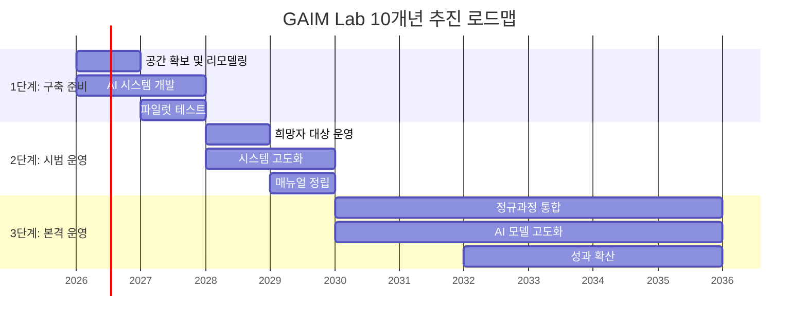
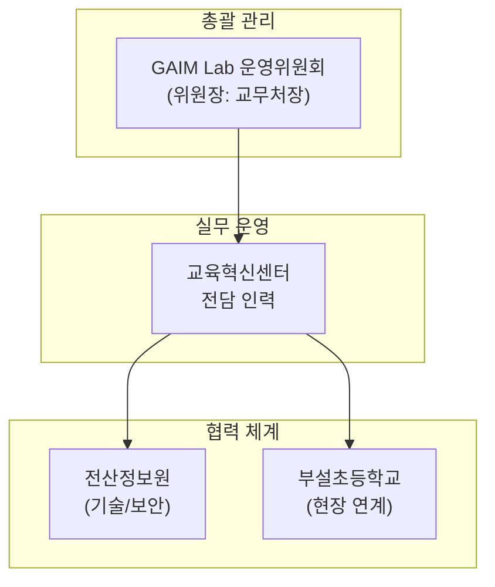

# [세부과제 I-①-2] AI 기반 교수학습 혁신: GINUE AI Microteaching Lab 운영

> **문서 정보**
> - 사업명: GINUE AI Microteaching Lab (GAIM Lab) 운영
> - 사업 기간: 2026년 3월 1일 ~ 2036년 2월 28일 (10년간)
> - 총 예산: 초기 3년 기준 7.2억 원
> - 최종 수정: 2026-02-05

---

## 1. 사업 목적

### 가. 예비교원 수업역량 강화

| 목표 | 세부 내용 |
|------|----------|
| **실전형 실습 환경 구축** | 실제 교실 환경을 완벽히 모사한 'GINUE AI Microteaching Lab(GAIM Lab)'을 구축하여 현장감 있는 모의수업 환경 제공 |
| **반복적 마이크로티칭 지원** | 예비교원이 수업 시연 후 AI의 즉각적인 피드백을 통해 자신의 교수법을 점검하고, 짧은 주기의 반복 연습(Microteaching)을 수행하여 교수 기술을 체화하도록 지원 |

### 나. AI 활용 수업분석 혁신

| 목표 | 세부 내용 |
|------|----------|
| **객관적 데이터 기반 분석** | AI 딥러닝 기술을 활용하여 수업 영상을 다각도(발문 수준, 상호작용 비율, 감정 톤, 시선 처리 등)로 분석, 기존의 주관적 평가를 보완하는 객관적 데이터 제공 |
| **자동화된 코칭 시스템** | 실시간 피드백 리포트를 통해 예비교원이 자신의 강점과 약점을 즉시 파악하고 성찰(Reflection)할 수 있도록 돕는 지능형 코칭 시스템 운영 |

### 다. 혁신적인 교수학습 모델 개발

| 목표 | 세부 내용 |
|------|----------|
| **미래형 교원양성 모델 정립** | Lab 운영을 통해 축적된 수업 빅데이터와 피드백 사례를 연구하여 AI 시대에 부합하는 새로운 교수학습 모델 및 수업설계 지침 개발 |
| **성과 확산** | 경인교대만의 특화된 AI 활용 교원양성 모형을 정립하고, 이를 타 대학 및 교육 현장에 확산하여 공교육의 질적 향상 선도 |

---

## 2. 사업 기간 및 로드맵

### 가. 사업 기간
**2026년 3월 1일 ~ 2036년 2월 28일 (10년간)**

### 나. 단계별 추진 로드맵

| 단계 | 시기 | 주요 내용 | 핵심 과제 |
|:----:|:----:|----------|----------|
| **1단계** | 2026~2027 | **GAIM Lab 구축 준비** | • 공간 확보 및 스마트 강의실 리모델링 • AI 분석 시스템(영상/음성) 개발 및 장비 도입 • 파일럿 테스트 및 수업 시나리오 개발 |
| **2단계** | 2028~2029 | **GAIM Lab 시범 운영** | • 희망자 및 일부 교과 대상 시범 운영 • 사용자 피드백 기반 시스템 고도화 • 운영 매뉴얼 정립 및 데이터 축적 |
| **3단계** | 2030~2035 | **본격 운영 및 확산** | • 정규 교육과정 필수 통합 (전 예비교원 대상) • AI 모델 정밀도 향상 및 기술 고도화 • 성과 공유 및 타 기관 확산 |

---

## 3. 세부 추진 계획

### 가. 지원 대상

| 구분 | 대상 | 세부 내용 |
|------|------|----------|
| **직접 수혜자** | 예비교원(학부생) | • 재학생 전원 대상 • (저학년) 희망자 및 관련 교과 수강생 중심의 자율 참여 유도 • (고학년) 교육실습 단계에서 1회 이상 필수 모의수업 수행 |
| **운영 인력** | 교원교육 전문인력 | • 교직과 교수진, 교육방법 전문가, AI 연수 이수 교원 등 • 멘토 및 코치 역할 수행 |
| **간접 수혜자** | 협력기관 관계자 | • 협력학교(부설초 등) 교사 • 타 교원양성기관 관계자 등 |

### 나. 주요 지원 내용

#### 1) GAIM Lab 인프라 구축

| 구분 | 세부 내용 |
|------|----------|
| **공간 조성** | 실제 교실을 재현한 스튜디오에 카메라, 고성능 마이크, IoT 센서 등을 설치하여 수업 장면을 다각도로 기록 |
| **시스템** | 대용량 영상 데이터의 실시간 전송·분석을 위한 클라우드 서버 및 초고속 네트워크망 구축 |
| **소프트웨어** | 음성 인식(STT), 안면 인식, 판서 OCR 등 AI 분석 솔루션 도입 |

#### 2) AI 기반 수업분석 시스템 운영

| 기능 | 세부 내용 |
|------|----------|
| **자동 분석** | 발화 속도, T-S(교사-학생) 대화 비율, 질문 빈도 및 유형 등을 자동 분석하여 리포트 생성 |
| **상호작용 시뮬레이션** | 가상 학생(Virtual Student)의 질문 및 반응(표정, 집중도) 시뮬레이션을 통한 대처 능력 배양 |
| **피드백** | 실시간 대시보드 및 세션 종료 후 종합 성찰 리포트 제공 |

#### 3) 교수역량 강화 프로그램 연계

- 교과목(교육방법론 등) 과제 연계 및 교생실습 전 마이크로티칭 워크숍 운영
- 동료 간 피드백 및 우수 사례 공유 활성화
- 개인별 **'수업 역량 포트폴리오'** 구축 지원 (임용시험 대비)

#### 4) 컨설팅 및 멘토링 (Human-in-the-loop)

- AI의 정량적 분석 결과와 멘토 교원의 정성적(맥락적) 피드백을 결합한 **입체적 코칭** 제공

#### 5) 평가 및 인증

- 정량 지표(AI)와 정성 평가(멘토)를 종합하여 피드백 제공
- 우수 시연자에게 **'디지털 배지'** 형태의 인증서 발급

### 다. 소요 예산 (초기 3년 기준)

| 구분 | 예산액 | 산출 내역 |
|------|-------:|----------|
| **Lab 구축비** | 2.5억 원 | 스튜디오 리모델링, 촬영/음향/센서 장비, 서버 및 SW 라이선스 |
| **시스템 개발비** | 2.0억 원 | AI 수업분석 엔진 개발/튜닝, 교육 특화 지표 설계 용역 |
| **운영 인건비** | 1.8억 원 | 전담 코디네이터 및 연구원 인건비(연 0.6억×3년), 멘토 수당 |
| **교육프로그램비** | 0.9억 원 | 워크숍 운영, 교재 개발, 디지털 배지 시스템 구축 등(연 0.3억×3년) |
| **합계** | **7.2억 원** | - |

---

## 4. 운영 방안

### 가. 연차별 추진 일정

| 연도 | 단계 | 주요 추진 내용 |
|:----:|:----:|---------------|
| **2026년** | 기획·설계 | 추진위 구성(3월), 공간/장비 확정(5월), AI 개발사 선정(6월) |
| **2027년** | 구축·개발 | Lab 공사 및 장비 설치(7~9월), 시나리오 개발 및 모델 1차 완성(10월), 파일럿 테스트(11~12월) |
| **2028년** | 시범운영 1년차 | 희망자 대상 오픈랩 운영(상반기), 시스템 개선 및 피드백 수집(하반기) |
| **2029년** | 시범운영 2년차 | 전공별 활용 주간 운영, 1차년도 성과 평가 워크숍 |
| **2030년** | 본격운영 | 정규 교과 통합(전 학생 참여), 성과교류회 개최 |
| **2031년~** | 확산 | AI 모델 고도화, 타 대학 공동 프로젝트 및 확산 추진 |

### 나. 관리 체계

| 구분 | 세부 내용 |
|------|----------|
| **주관부서** | GAIM Lab 운영위원회 (위원장: 교무처장, 구성: 교수진, 현장교사 등) |
| **실무운영** | 교육혁신센터 내 전담 인력 배치 |
| **협력체계** | 전산정보원(기술/보안), 부설초등학교(현장 연계)와 협력 |
| **운영지침** | AI 윤리 가이드라인 준수(개인정보 동의 필수), 예약 시스템 운영, 데이터 품질 관리(QA) 프로세스 정립 |

---

## 5. 성과 관리 계획

### 가. 정량적 성과 지표 (KPI)

| 지표 구분 | 성과 지표명 | 목표치 (연차별 상향) |
|----------|------------|---------------------|
| **Lab 활용도** | 연간 Lab 이용 횟수 | 연 **1,000회** 이상 |
|  | 참여 학생 수 | **500명** 이상 |
|  | 전체 재학생 대비 이용률 | 재학생 **80%** 이상 달성 |
| **피드백 실적** | AI 분석 리포트 생성 건수 | 학생 1인당 **2건** 이상 |
|  | 멘토링 매칭 및 코칭 건수 | 학기당 **200건** |
| **역량 향상** | 수업 시연 점수 향상도 (사전-사후 비교) | 평균 **15%** 이상 향상 |
|  | 디지털 배지(인증) 발급 건수 | 연 **100건** 발급 |
| **성과 확산** | 타 대학/기관 벤치마킹 방문 횟수 | 연 **5개 기관** 이상 |
|  | 관련 연구 논문 및 학술대회 발표 | 연 **2건** 이상 |

### 나. 정성적 성과

| 영역 | 기대 효과 |
|------|----------|
| **전문성 향상** | 예비교원의 수업에 대한 자신감 상승 및 자기 주도적 수업 개선 능력 함양 |
| **태도 변화** | 경험/관행 중심에서 **'데이터 증거 기반(Data-driven)'**의 수업 성찰 태도로 변화 |
| **교육과정 혁신** | AI와 에듀테크를 접목한 미래형 교원 양성 교육과정의 실질적 구현 |

---

## 6. 향후 발전 방안

### 가. 지속가능성 및 확대

- 사업 종료 후 **교비 예산 편성**을 통한 상시 운영 체계로 전환
- 교육대학원생 및 현직 교원 연수 프로그램으로 대상을 확대하여 지역사회 기여

### 나. 기술 고도화

| 기술 영역 | 발전 방향 |
|----------|----------|
| **VR/메타버스** | 가상 교실 환경을 고도화하여 실제와 유사한 몰입감 및 다양한 돌발 상황 시나리오 제공 |
| **자연어 처리(NLP)** | 단순 빈도 분석을 넘어 맥락을 이해하는 정교한 대화 분석 및 피드백 기술 개발 |

### 다. 네트워크 및 확산

- 전국 교원양성대학과 **컨소시엄**을 구성하여 운영 노하우 공유 및 공동 연구 추진
- 교육부 등 정책 기관과 협력하여 **'AI 기반 교원양성 국가 표준 모델'**로 발전 및 보급

### 라. 현장 적용 (Spin-off)

- Lab에서 검증된 AI 분석 도구를 경량화하여 일선 학교에 보급, 현직 교사 수업 장학 지원
- 신규 임용 교사를 위한 **온라인 모의수업 코칭 프로그램**으로 확장

---

## 부록: 연관 시스템

> [!NOTE]
> GAIM Lab은 기존 Multimodal Lecture Coach(MLC) 시스템과 기술적으로 연계됩니다.
> - **Turbo Mode v3**: GPU 가속 FFmpeg(scale_cuda) 기반 영상 처리
> - **openai-whisper STT**: 수업 발화 자동 전사
> - **7차원 평가 프레임워크**: 초등 임용 2차 수업 시연 평가 기준 기반 100점 척도

---

*본 계획서는 GINUE 2035 중장기 발전계획의 세부과제로서, 정부 재정지원사업 및 대학 혁신지원사업 표준 서식에 따라 작성되었습니다.*
